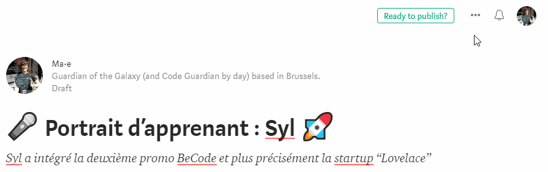

# Blog Becode : How to participate from Medium

You want to share tuto, write small posts to tell stories about what happen inside BeCode, publish some awesome stuff you prepare for your watch or workshop?    
The easiest way is to use Medium. You can create your account using Twitter, Google or Facebook so you don't have to create another account and remember another password.

Once you wrote something you think could be published on the BeCode's blog, contact Emily (by Ryver or by email) and send her your draft. She will review it. If your post is OK, she will promote you as an official writer on the blog and you will be able to publish your future post by yourself.

When you are a writer, you can do link your post to the BeCode blog (a blog is called a "publication" on Medium):
- click on [...],
- then on [Add to publication],
- then check on [Becode],
- and finally click on [Add draft].

### Beware!
- Your content will be reviewed by coach but please, do your possible to make your post understandable and without spelling or grammatical errors.
- Please if you use picture of someone, always ask the autorisation to publish it before publishing it. May this person be on the picture or be the author of it.. And, if you use pictures, always quote the author.

### Bonus

[Little advices from Quincy Larson, from FreeCodeCamp](https://medium.freecodecamp.org/how-to-write-medium-stories-people-will-actually-read-92e58a27c8d8)
