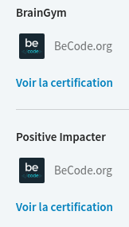

# Les badges badgr.io

Tu as reçu des badges qui attestent de tes nouvelles compétences ? Tu veux les mettre sur LinkedIn sauf que tu ne parviens à les partager qu'en tant que post et c'est pas beau. Tu aimerais qu'ils figurent sur ton profil comme tes autres certifications acquises sur OpenClassRooms & co... Pas de souci !

Voici deux tutos pour t'aider dans ta quête de reconnaissance :
- [Premier tuto réalisé par Tan Phan, team Cycorp](https://github.com/TanPhanCy/tutobadge)
- [Second tuto issu de la documentation de badgr.io](https://support.badgr.io/pages/viewpage.action?pageId=4554758)

Du coup, ça donne ça : 

