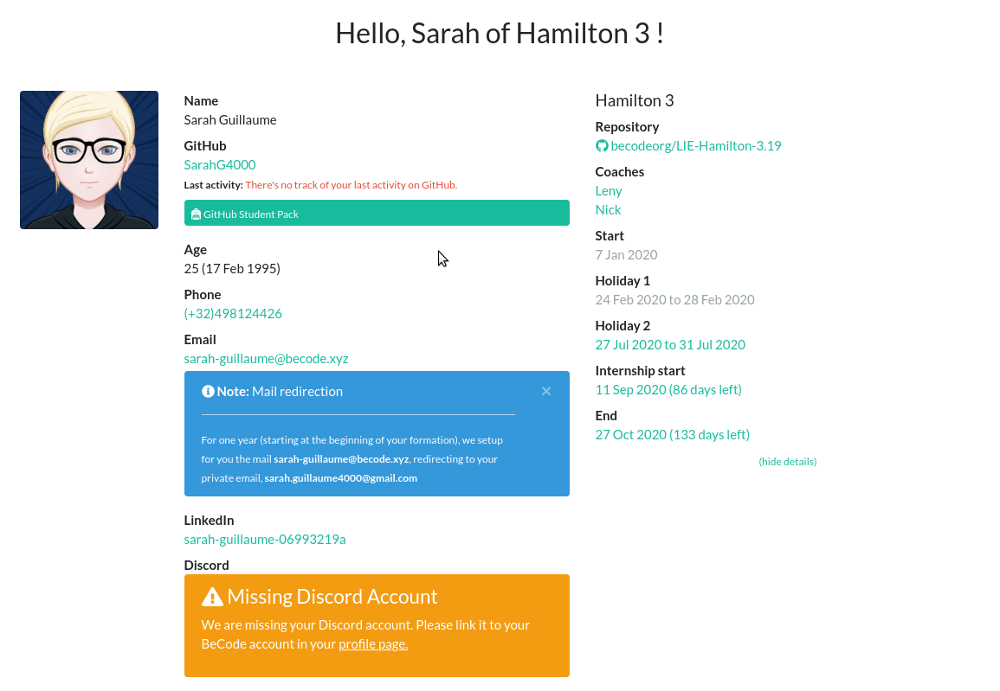
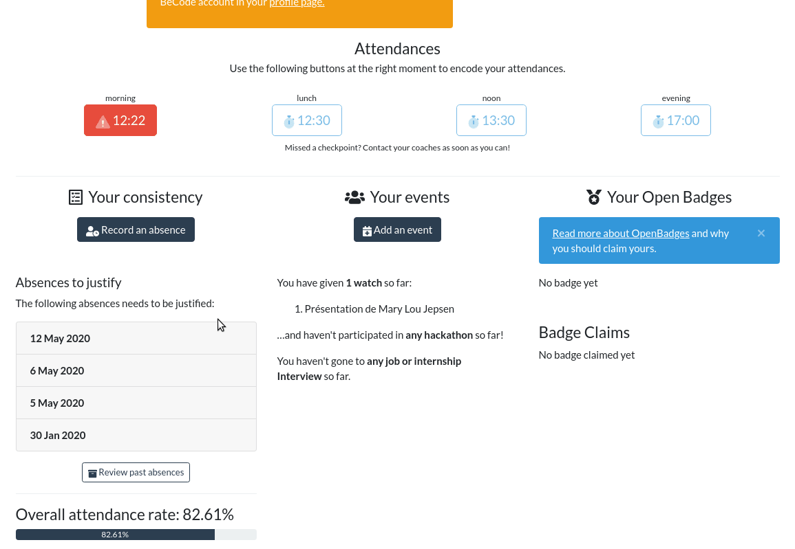

# my.becode.org: absences

[[Version francophone](procedure-mybecode.md)]
How to use my.becode.org for absences/delays/early departures/events?

- Process
    - [Press the presence button](#press-the-presence-button)
    - [Communicating an absence, a delay, an early departure](#communicating-an-absence-a-delay-an-early-departure)
    - [Add a justification after the absence](#add-a-justification-after-the-absence)
    - [The different statuses of your absences](#the-different-statuses-of-your-absences)

- Documents BeCode to communicate : which ones and in which case
    - [Attestation Participation Evenement](#attestation-participation-evenement)
    - [Demande absence exceptionnelle](#demande-dabsence-exceptionnelle)
    - [Déclaration sur l'honneur](#déclaration-sur-lhonneur)

## Process

### Press the presence button

You will be asked to check in every day:
- BEFORE or at 09:00 SHARP (otherwise you will be considered late)
- AFTER or at 12:30 SHARP (not before, otherwise it is considered an early departure)
- BEFORE or at 13:30 SHARP (not after, otherwise it is considered late)
- AFTER or at 17:00 SHARP (not before, otherwise it is considered an early departure)

This is YOUR responsibility, not your coach's.

### Communicating an absence, a delay, an early departure:

You can register an absence, a delay or an early departure.    
Example: Are you sick? Send an e-mail to your coaches and enter your absence in my.becode.    
You have a dentist appointment in two months? Send an email to your coaches and already register your absence in my.becode.

### Add a justification after the absence

Let us take the example of the dentist. You have warned but you only received the presence proof once you have been to the dentist. Makes sense. Go back to the interface, search for your absence and upload the receipt.

### The different statuses of your absences

Pending: Your EMO hasn't had time to consider whether your absence is justifiable or not.
Accepted: There is no problem.
Rejected: Absence is not considered justifiable.

**TO BE JUSTIFIED, IT IS MANDATORY THAT EVERY ABSENCE/DELAY/DEPARTURE MUST BE ACCOMPAGNIED BY A CERTIFICATE/JUSTIFICATION UPLOADED**

No need to try to bribe your coaches, they are not responsible for approving or not approving an absence.

For the consequences, consult the [Pedagogical Contract](educationalcontract.md).

## Documents
These are the official documents that you must join in my.becode.org in the case of participation of events, internship appointment, strike,... You must have them signed by your coaches BEFORE sending them in my.becode.org otherwise, they will not be considered valid.
### Attestation Participation Evenement
📜 [[doc](https://drive.google.com/open?id=1eYnm-aO4o7ABMrj3Ra0kzA1eYd_apoEFoFp28AFKCEo)]
To fill in case of hackathon, CoderDojo, workshop externe, Jobday,... (all BeCode events happening outside the class).
### Demande d'absence exceptionnelle
📜 [[doc](https://drive.google.com/open?id=10f1aYfy1lbytk8Dg8ll3YZOTvPRg0FpGrbn9FnuQHE8)]
To fill in case of internship interview, pedagogical day (the day during which the coaches are not there).
### Déclaration sur l'honneur
📜 [[doc](https://drive.google.com/open?id=0B1mdnkbeKh9FbFVVTTlxRGVlWm5fNDN3U2Y3RXBzYmE1cmhR)]
To fill in case of public transport strike.
