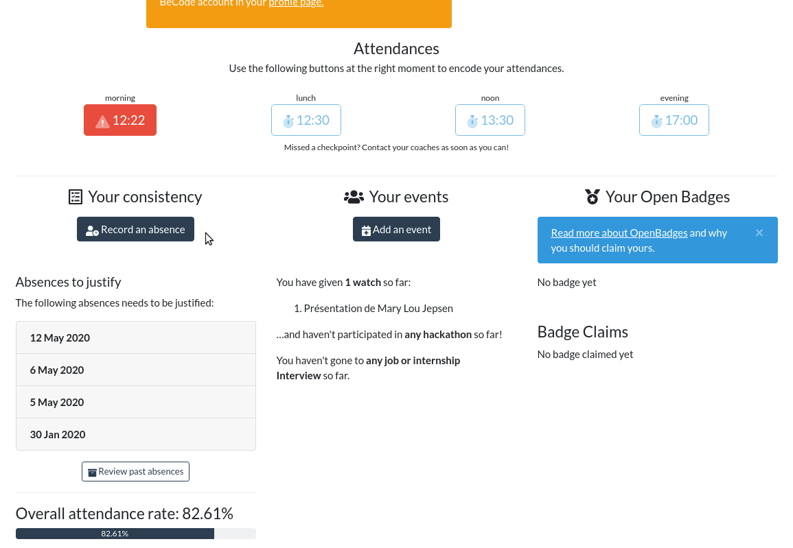
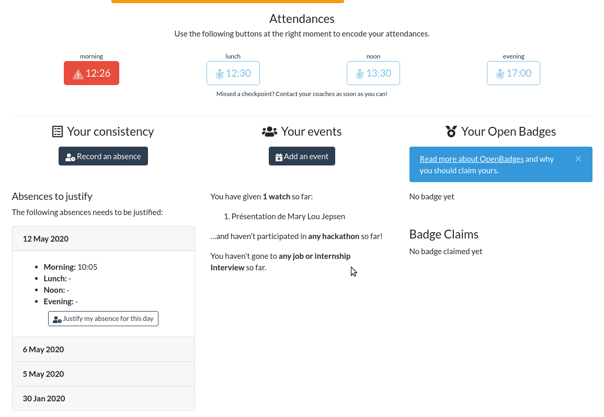

# my.becode.org : absences

[[English version](mybecode-absence-eng.md)]    
Comment utiliser la plateforme my.becode.org pour les absences/retards/départs anticipés/événements ?

- Procédures
    - [Pointer !](#pointer-)
    - [Communiquer une absence, un retard, un départ anticipé](#communiquer-une-absence-un-retard-un-d%C3%A9part-anticip%C3%A9-))
    - [Ajouter un justificatif après l'absence](#ajouter-un-justificatif-apr%C3%A8s-labsence)
    - [Les différents status de vos absences](#les-diff%C3%A9rents-status-de-vos-absences)

- Documents BeCode à transmettre : lesquels et dans quel cas
    - [Attestation Participation Evenement](#attestation-de-participation-à-un-évènement)
    - [Demande absence exceptionnelle](#demande-dabsence-exceptionnelle)
    - [Déclaration sur l'honneur](#déclaration-sur-lhonneur)

## Procédures

## Pointer :

Il vous sera demander de pointer tous les jours :
- AVANT ou à 09:00 PILE (sinon vous serez considéré comme en retard)
- APRES ou à 12:30 PILE (pas avant, sinon c'est considéré comme un départ anticipé)
- AVANT ou à 13:30 PILE (pas après, sinon, c'est considéré comme un retard)
- APRES ou à 17:00 PILE (pas avant, sinon, c'est considéré comme un départ anticipé)

C'est VOTRE responsabilité, pas celles de votre coach.

## Communiquer une absence, un retard, un départ anticipé :

Vous pouvez enregistrer une absence, un retard ou un départ anticipé.    
Exemple : Vous êtes malade ? Envoyez un mail à vos coachs et inscrivez votre absence dans my.becode.    
Vous avez rendez-vous chez le dentiste dans deux mois ? Envoyez un mail à vos coachs et inscrivez déjà votre absence dans my.becode.

**JUSTIFIER SYSTEMATIQUEMENT TOUT RETARD, DEPART, ABSENCE AVEC UN JUSTIFICATIF** : Vous êtes en stage donc déjà à l'emploi. Vous devez justifier de vos absences avec des documents officiels (certificat du médecin, attestation de la commune ou syndicat, attestation grève/retard des transports des communs)

## Ajouter un justificatif après l'absence

Reprenons l'exemple du dentiste. Vous avez prévenu mais vous n'avez votre justificatif qu'une fois être allé chez le dentiste. Logique. Retournez dans l'interface, cherchez votre absence et uploadez le justificatif.

## Les différents status de vos absences

Pending : Votre EMO n'a pas eu le temps de regarder si votre absence est justifiable ou pas.
Accepted : Il n'y a pas de souci.
Rejected : L'absence n'est pas considéré comme justifiable.

Inutile de tenter de corrompre vos coachs, ils ne sont pas responsables de l'approbation ou non d'une absence.

Pour les conséquences, reconsultez le [Contrat Pédagogique](contratpedagogique.md).

## Documents
Ce sont les documents officiels que vous devez introduire dans my.becode.org dans le cas de participation à des événements, rendez-vous de stage, grève,... Vous devez les faire signer par vos coachs AVANT de les envoyer dans my.becode.org sinon, ils ne seront pas considérés comme valides.
### Attestation de participation à un évènement
📜 [[doc](https://drive.google.com/open?id=1eYnm-aO4o7ABMrj3Ra0kzA1eYd_apoEFoFp28AFKCEo)] - [[doc version FOREM](https://docs.google.com/document/d/1eYnm-aO4o7ABMrj3Ra0kzA1eYd_apoEFoFp28AFKCEo/edit?usp=sharing)]
A remplir en cas de hackathon, CoderDojo, workshop externe, Jobday,... (tous les évènements BeCode qui se passe en dehors de la classe).
### Demande d'absence exceptionnelle
📜 [[doc](https://drive.google.com/open?id=10f1aYfy1lbytk8Dg8ll3YZOTvPRg0FpGrbn9FnuQHE8)]
A remplir en cas d'entretien de stage, de journée pédagogique (la journée durant laquelle les coachs ne sont pas là).
### Déclaration sur l'honneur
📜 [[doc](https://drive.google.com/open?id=0B1mdnkbeKh9FbFVVTTlxRGVlWm5fNDN3U2Y3RXBzYmE1cmhR)]
A remplir en cas de grève des transports publics.
