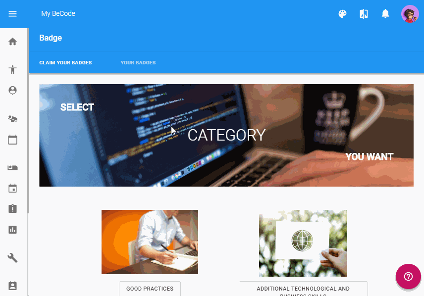

# my.becode.org : badges

Les badges de compétences décernés par BeCode peuvent être obtenus de plusieurs façons.

## Qu'est-ce que c'est, à quoi ça sert ?

Mais avant toute chose, sachez qu'ils attestent qu'un organisme reconnu par Bruxelles Formation (BeCode dans votre cas) atteste que vous possédez des compétences techniques ou autres.    

Vous pouvez [partager vos badges de compétence sur votre profil LinkedIn](certified-skills-fr.md) et également sur vos sites personnels (portfolio).    

Nous les utilisons également pour la plateforme Talents (à venir) qui permettra la mise en relation des Juniors de BeCode avec des employeurs ou des clients.    
Egalement, ces badges figureront sur les rapports d'évaluation qui attestent que durant votre parcours, vous avez acquis différentes compétences.    

Nous travaillons actuellement en étroite collaboration avec les différents acteurs nationaux et internationaux pour faire reconnaître notre système et également inciter les autres centres de formation à l'utiliser. Nous sensibilisons également les employeurs depuis l'ouverture de BeCode pour qu'ils aient conscience de la valeur de ces badges.

En gros, c'est pas pour rigoler.

## Pour les compétences techniques
Vous avez participé à un projet qui présentait des challenges pédagogiques à valider ou à acquérir. Vous avez mené le projet à bien et prouver que vous étiez capable d'utiliser les compétences requises.
- Votre coach vous attribue spontanément les badges de compétences au fur et à mesure lorsqu'il constate que vous méritez tel ou tel badge.
- Vous réclamez vos badges de compétences via my.becode.org en suivant la procédure :

### Procédure
La plateforme vous demande de rentrer
- un ``URL from GitHub Repository`` => là où on peut inspecter le code,
- et un ``URL from the project Site`` => là où on peut tester le code/voir le site fonctionnel.

Si vous ne fournissez pas les bons URL, nous ne chercherons pas pour vous. Nous refuserons donc l'attribution du badge et vous inviterez à le re-réclamer.

## Pour les badges non techniques
(soft-skills, participation à des évènements,...) :
- vous pouvez réclamer votre badge de compétence via my.becode.org. La plateforme vous demande de rentrer un ``URL from GitHub Repository`` (là où on peut inspecter le code) et un ``URL from the project Site`` (là où on peut tester le code/voir le site fonctionnel). Puisqu'il ne s'agit pas de compétences techniques, indiquez simplement dans les deux champs l'URL de votre compte GitHub.
