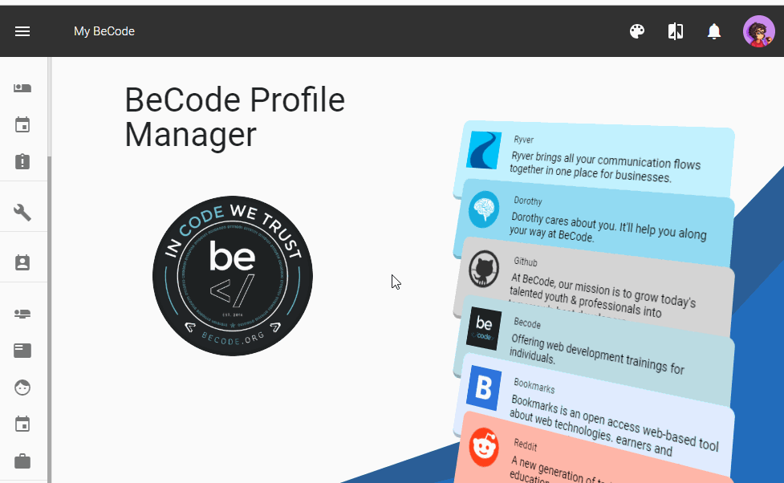

# my.becode.org: events
How and why encode your participation to event inside my.becode.org

Hi folks!
We are proud to announce that you can now have access to the [**events section**](https://my.becode.org/eventusers) on [my.becode.org](https://my.becode.org/eventusers).    

## Why do it ?

To indicate that you participated in events like hackathons, code initiation for kids, hosted a workshop, went to a conference ...  during your training at BeCode. They will appear on your personal file at FOREM/VDAB/ACTIRIS. They will also appear on your personal profile on talents.becode.org (in preparation).    

Make sure to also mention each Watch and/or workshop you animated in front of your startup! #publicspeaking #ftw

For example: "**Meaningful Code by Yann Lemin**" was a **conference** animated on **23rd august 2018**. You, as learners, may have attend to this conference so it will be register as a Conference Participation.

About the different type:
- Code Initiation
- CoderDojo => A code initiation but under the brand Coder Dojo
- Information Session: You are a BeCode ambassador, spreading the word
- Hackathon
- Job Interview
- if you attend a conference => **conference particiapation**
- if you ANIMATE the conference => **conference animation**
- if you attend a workshop => **workshop participation**.
- if YOU ANIMATE the workshop => **workshop animation**.

Happy eventing !
