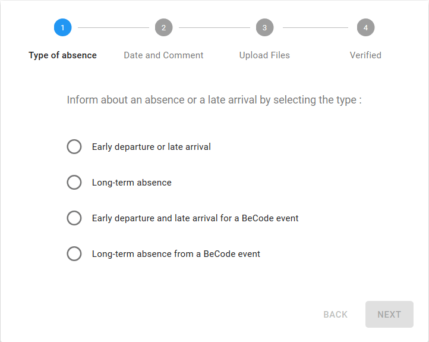

# My BeCode
[[Version francophone](procedure-mybecode.md)]    
How to use my.becode.org for absences/delays/early departures/events?

- Process
    - [Absence not planned with proof](#absence-not-planned-with-proof)
    - [Delay planned with proof](#delay-planned-with-proof)
    - [Delay not planned but justifiable](#Delay-not-planned-but-justifiable)
    - [Absence planned](#absence-planned)
    - [Absence for a BeCode event](#absence-for-a-BeCode-event)
- Documents BeCode to communicate : which ones and in which case
    - [Attestation Participation Evenement](#attestation-participation-evenement)
    - [Demande absence exceptionnelle](#demande-dabsence-exceptionnelle)
    - [Déclaration sur l'honneur](#déclaration-sur-lhonneur)
- Into my.becode
    - [Early departure or late arrival](#early-departure-or-late-arrival)
    - [Long-term absence](#long-term-absence)
    - [Early departure and late arrival for a BeCode event](#early-departure-and-late-arrival-for-a-becode-event)
    - [Long-term absence from a BeCode event](#long-term-absence-from-a-becode-event)
    
## Process
### Absence not planned with proof
Example : sickness
- go to « Absence planner » 
- check « Long-term absence »
- explain the reason of your absence

ℹ️ It is possible to **upload your proof later** but do it as soon as possible or it will be considered injustified.
Go to « Absence notifier », retrouve l'absence à justifier, envoie le document qu'il manquait.

**Any absence must be notified via the form or it will be considered as an unjustified absence.**

### Delay planned with proof
Exemple : rendez-vous administratif
- go to « Absence planner » 
- check « Early departure and late arrival »
- explain the reason of your early departure or your late arrival 

ℹ️ A delay or early departure without proof is equivalent to half a day of unjustified absence. It is possible to upload a photo (or PDF) of your proof afterwards.

### Delay not planned but justifiable
Example : retard SNCB
- got to « Absence planner » 
- check « Early departure and late arrival »
- explain the reason
- send the proof of train delay that you will find on the SNCB website.

### Absence planned
- check « Long-term absence » and explain the reason why you're not there

ℹ️ It is strongly recommended to upload your proof as soon as possible to avoid any problem of unjustified absence.

### Absence for a BeCode event
- check « Early departure and late arrival for a BeCode event » or « Long-term absence from a BeCode event »
- tell us to what event you're going
- send us the picture/scan of the "attestation participation événement" document filled with the coach's signature.

## Documents
These are the official documents that you must join in my.becode.org in the case of participation of events, internship appointment, strike,... You must have them signed by your coaches BEFORE sending them in my.becode.org otherwise, they will not be considered valid.
### Attestation Participation Evenement
📜 [[doc](https://drive.google.com/open?id=1eYnm-aO4o7ABMrj3Ra0kzA1eYd_apoEFoFp28AFKCEo)]
To fill in case of hackathon, CoderDojo, workshop externe, Jobday,... (all BeCode events happening outside the class).
### Demande d'absence exceptionnelle 
📜 [[doc](https://drive.google.com/open?id=10f1aYfy1lbytk8Dg8ll3YZOTvPRg0FpGrbn9FnuQHE8)]
To fill in case of internship interview, pedagogical day (the day during which the coaches are not there).
### Déclaration sur l'honneur 
📜 [[doc](https://drive.google.com/open?id=0B1mdnkbeKh9FbFVVTTlxRGVlWm5fNDN3U2Y3RXBzYmE1cmhR)]
To fill in case of public transport strike.

## In my.becode
### Early departure or late arrival
Use when you arrive after 9am or when you leave earlier than 17h.
### Long-term absence
Use when you will not be in class for one or more days
### Early departure and late arrival for a BeCode event
Use when you arrive after 9am or when you leave earlier than 17h because of a BeCode event => External workshop
### Long-term absence from a BeCode event
Use when you will not be in class for one or more days because of a BeCode event => Hackathon, Coach' Pedagogical Day

